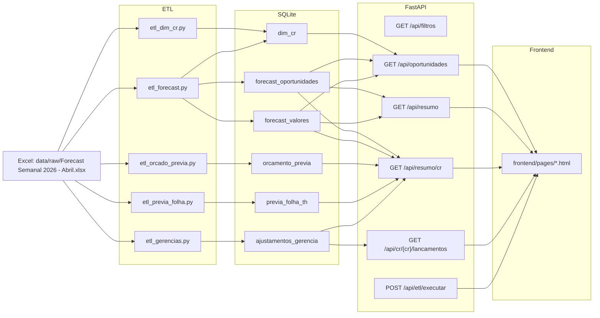

# Arquitetura do PREVIA

## Fluxo geral

1. O Excel é colocado em `data/raw/`.
2. Os scripts em `backend/etl/` extraem e transformam os dados para o SQLite em `data/db/previadb.db`.
3. A API FastAPI (`backend/api/app.py`) consulta o banco e expõe os endpoints REST.
4. O frontend (`frontend/pages/`) consome a API para exibir as páginas de análise.

## DRE e registros implantados

A DRE atual é construída a partir de múltiplos conjuntos de dados:

- `orcamento_previa` traz as categorias orçadas de despesas por CR
- `forecast_valores` e `forecast_oportunidades` trazem a receita prevista
- `ajustamentos_gerencia` guarda ajustes de crédito e débito lançados por gerência
- `previa_folha_th` contém os valores de folha previstos por CR

Esses registros alimentam a geração da DRE no frontend, permitindo:

- calcular `MC Orçado` e `MC Prévia`
- comparar valores orçados com valores de prévia
- exibir desvios em pontos percentuais
- mostrar o atingimento esperado de margem

## Quais ETLs alimentam quais tabelas

- `backend/etl/etl_dim_cr.py` → `dim_cr`
- `backend/etl/etl_forecast.py` → `dim_cr`, `forecast_oportunidades`, `forecast_valores`
- `backend/etl/etl_gerencias.py` → `ajustamentos_gerencia`
- `backend/etl/etl_orcado_previa.py` → `orcamento_previa`
- `backend/etl/etl_previa_folha.py` → `previa_folha_th`

## Quais rotas consomem quais tabelas

- `/api/filtros` → `dim_cr`, `forecast_oportunidades`, `forecast_valores`
- `/api/oportunidades` → `forecast_oportunidades`, `forecast_valores`, `dim_cr`
- `/api/resumo` → `forecast_oportunidades`, `forecast_valores`, `dim_cr`
- `/api/resumo/cr` → `forecast_oportunidades`, `forecast_valores`, `dim_cr`, `orcamento_previa`, `previa_folha_th`, `ajustamentos_gerencia`
- `/api/cr/{cr}/lancamentos` → `ajustamentos_gerencia`
